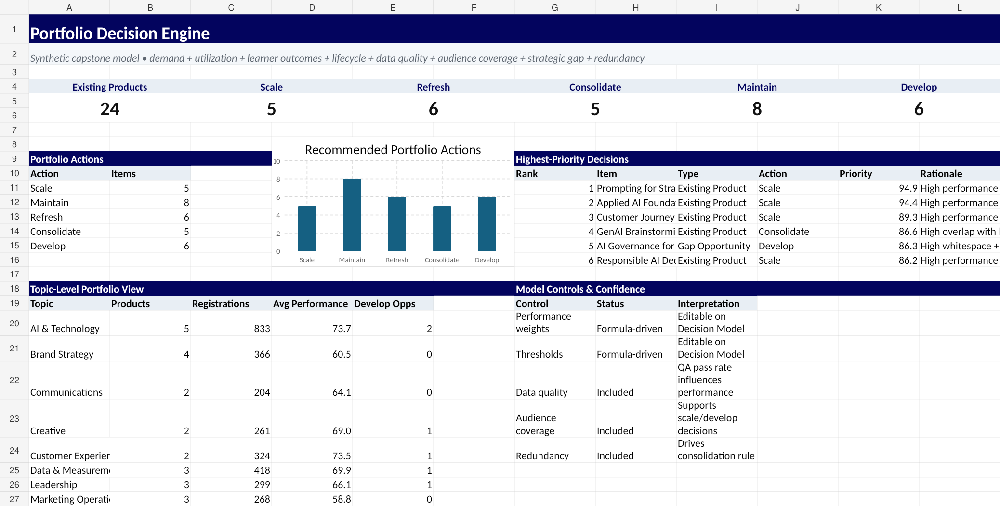
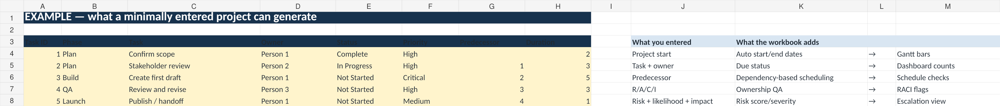
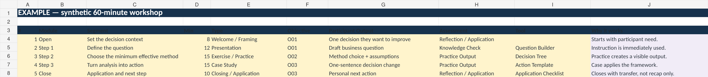
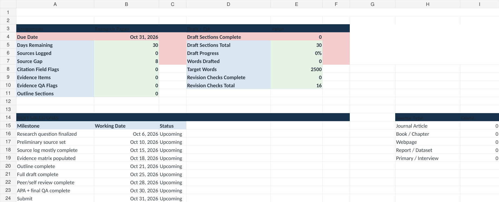

# Tools & Templates

Public-safe tools built from Laura Elizabeth Hand's research, teaching, project-management, curriculum, analytics, career-readiness, and decision-support methods.

**Current release:** v1.0.0 · October 1, 2026 · [Release notes](RELEASE_NOTES.md) · [Release manifest](manifest.json)

<table>
<tr>
<td width="50%"> <strong>Decision Engine</strong></td>
<td width="50%"> <strong>Project Management Control Center</strong></td>
</tr>
<tr>
<td width="50%"> <strong>Curriculum / Workshop QA</strong></td>
<td width="50%"> <strong>Research Writing Planner</strong></td>
</tr>
</table>

## Resource library

| Resource | Download | Focus |
| --- | --- | --- |
| [Automated Project Management Control Center](project-management/) | [Excel workbook](project-management/Automated_Project_Management_Control_Center.xlsx) | Scheduling, Gantt, RACI, risks, project health |
| [APA 7 Research Writing Toolkit](apa-research-writing/) | [Word template](apa-research-writing/APA7_Student_Research_Paper_Template.docx) · [Guide](apa-research-writing/APA7_Research_Writing_Toolkit_Guide.docx) · [Research planner](apa-research-writing/Research_Writing_Planner_and_Evidence_Matrix.xlsx) | Research planning, APA structure, evidence, revision |
| [Literature Review & Evidence Synthesis Matrix](literature-review/) | [Excel workbook](literature-review/Literature_Review_Evidence_Synthesis_Matrix.xlsx) | Source-to-claim synthesis and gap analysis |
| [Curriculum / Workshop QA & Outline Builder](curriculum-workshop-qa/) | [Excel workbook](curriculum-workshop-qa/Curriculum_Workshop_QA_and_Outline_Builder.xlsx) | Objectives, agenda, practice, assessment, QA |
| [Career Readiness Resource System](career-readiness/) | Resource architecture + applied-work provenance | Interview evidence mapping, story banks, accomplishment recovery, career-resource design |
| [Decision, Prioritization & Needs-Assessment System](decision-prioritization/) | [Excel workbook](decision-prioritization/Laura_Hand_Portfolio_Decision_Engine.xlsx) | Transparent multi-criteria decisions and sensitivity |
| [Survey / Needs-Assessment Builder & Analysis Workbook](survey-needs-assessment/) | [Excel workbook](survey-needs-assessment/Survey_Needs_Assessment_Builder_and_Analysis_Workbook.xlsx) | Instrument design, data QA, segmentation, findings |
| [Research Project Ethics & IRB Readiness Toolkit](research-ethics-irb/) | [Excel workbook](research-ethics-irb/Research_Project_Ethics_and_IRB_Readiness_Toolkit.xlsx) | Ethics, consent, privacy, recruitment, review readiness |
| [Quantitative Research & Statistical Analysis Planner](quantitative-analysis/) | [Excel workbook](quantitative-analysis/Quantitative_Research_Statistical_Analysis_Planner.xlsx) | SPSS-ready planning, hypotheses, QA, assumptions, reporting |

## Design standard

Every resource follows the same usability model:

- **minimum input** — users enter only what the system cannot reasonably infer;
- **maximum useful output** — calculations, flags, schedules, matrices, summaries, and dashboards populate automatically where practical;
- **instructions in the artifact** — the tool explains how to use it rather than assuming prior knowledge;
- **labeled edit zones** — INPUT, AUTO, OPTIONAL, and ACTION NEEDED are explicitly distinguished;
- **accessible meaning** — color supports labels but does not carry meaning by itself;
- **transparent automation** — automation handles repetitive work without presenting judgment as a formula;
- **public-safe examples** — no employer, client, learner, member, or proprietary source data is included.

## Publishing and privacy

Public resources are newly built or reconstructed with synthetic, generic, public-domain, or openly licensed examples. Authorized institutional examples may be linked as applied-work evidence without being duplicated into this repository when their contents include institutional or third-party material.

See the repository's [Public Portfolio Publishing Checklist](../PORTFOLIO_PUBLISHING_CHECKLIST.md) for the publication standard.
