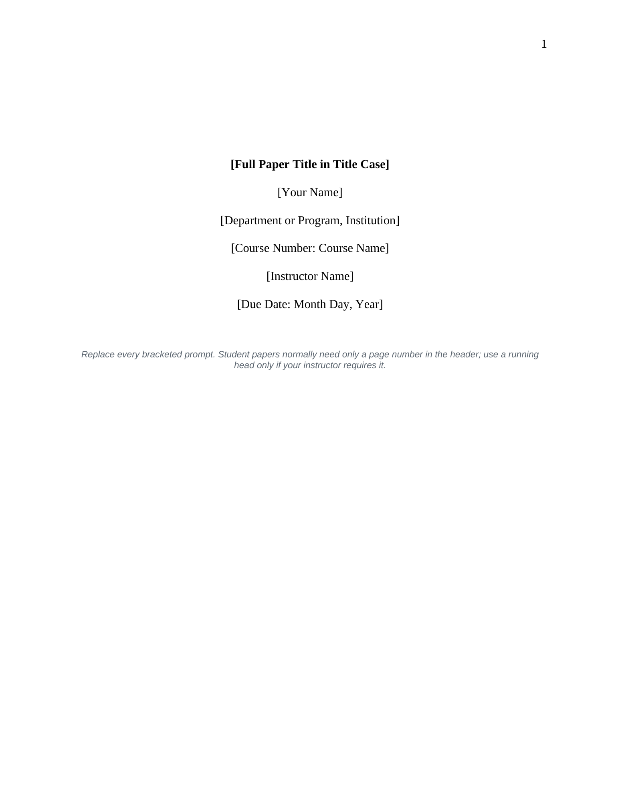

# APA 7 Research Writing Toolkit

A coordinated research-writing package for moving from assignment planning through evidence collection, drafting, revision, and APA-style submission.

<table>
<tr>
<td width="34%"></td>
<td width="66%"></td>
</tr>
</table>

*Preview: the Word template handles paper structure while the workbook surfaces deadlines, source/evidence gaps, draft progress, revision checks, and next milestones.*

## Prepared artifacts

- [Download the APA 7 Word template](APA7_Student_Research_Paper_Template.docx)
- [Download the toolkit guide](APA7_Research_Writing_Toolkit_Guide.docx)
- [Download the research planner and evidence matrix](Research_Writing_Planner_and_Evidence_Matrix.xlsx)

## What it supports

- an APA 7 student-paper structure that is ready to write in;
- research-question and milestone planning;
- source and evidence tracking;
- outline-to-draft workflow;
- revision and submission QA;
- concise instructions embedded alongside the tools.

The toolkit is designed to reduce formatting and project-management friction so the writer can spend more attention on research, synthesis, and argument.

[Back to Tools & Templates](../README.md)
